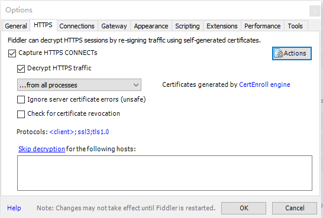
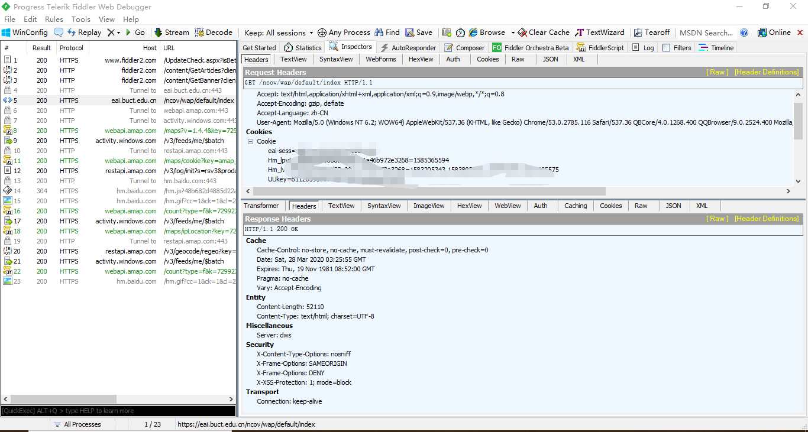
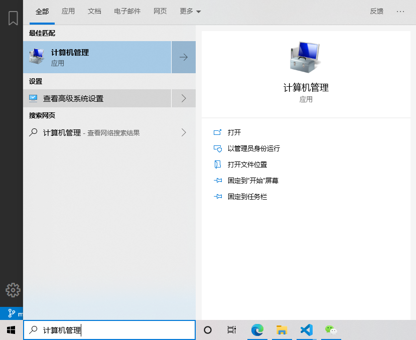
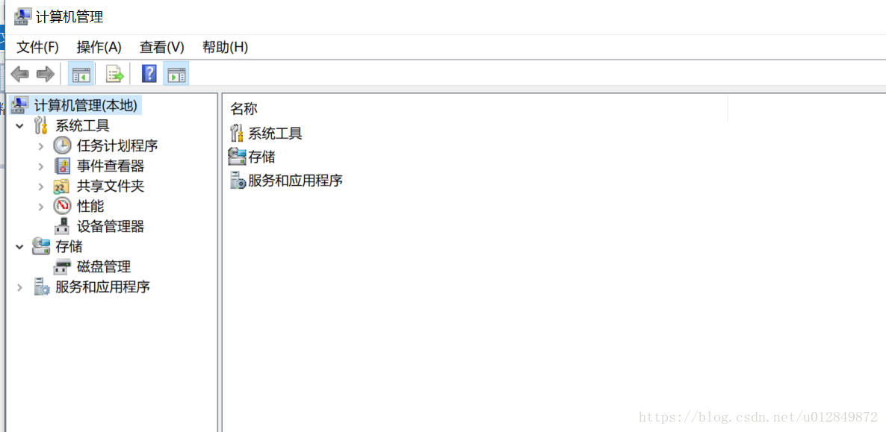

<!--
 * @Author: your name
 * @Date: 2020-03-28 10:35:53
 * @LastEditTime: 2020-03-28 10:44:10
 * @LastEditors: Please set LastEditors
 * @Description: In User Settings Edit
 * @FilePath: \BUCT_nCoV_Report\README.md
 -->
# BUCT_COVID-19_Report
基于 Python3 的适用于北京化工大学的 COVID-19 自动填报脚本

项目用于学习交流，仅用于各项无异常时打卡，如有身体不适等情况还请自行如实打卡

## 使用方式

1. 在微信进入“疫情防控”页面，抓包获得'cookies'，修改'report.py'内的'cookies'值
    ```text
    'eai-sess':'', 
	  'UUkey':''
    ```
2. 修改 `report.py` 内的经纬度（可选)
3. 填写 `province` 和 `city`避免报 `上报位置不能为空` 错误
4. 安装所需依赖：`pip3 install requests`（Windows下请用命令提示符输入，报错请检查PATH；Linux在shell直接打就行）
5. 执行 `report.py`

## 抓包方法

### 抓包方法视频教程[BiliBili](https://www.bilibili.com/video/BV1bC4y147Pj) [Youtube](https://www.youtube.com/watch?v=oAiY4iCu9Kk)


可以使用`Fiddler` + `企业微信` 进行抓包获得cookies，需要进入Tools-Options-HTTPS处打开HTTPS流量解密，具体方法可参考[简书](https://www.jianshu.com/p/690eb9bebe3c)




## 自动化
### Window：任务计划程序

1. 在 windows搜索：“计算机管理”，进入如下界面：


2. 选择 系统工具 -->  任务计划程序 ，点击右侧的  “创建基本任务”，进入如下界面
3. 参考这篇博文：https://blog.csdn.net/u012849872/article/details/82719372

### Linux：使用 Crontab

```shell script
sudo crontab -e
```

每天早晨 6 点上报
```shell script
0 6 * * * python3 report.py
```

